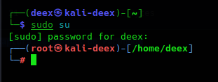
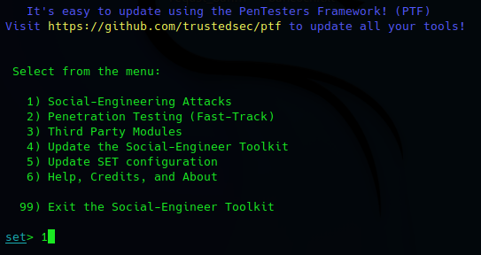
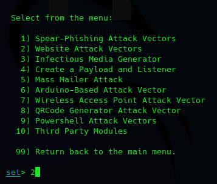
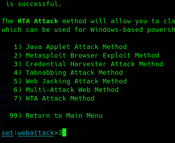
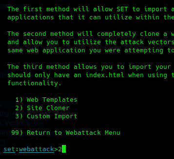

# Phishing para captura de senhas do Facebook

### Ferramentas

- Kali Linux
- setoolkit

### Configurando o Phishing no Kali Linux

- Acessando root: ``` sudo su ```


- Iniciando o setoolkit: ``` setoolkit ```

---


- Tipo de ataque: ``` Social-Engineering Attacks ```


- Vetor de ataque: ``` Web Site Attack Vectors ```


- Método de ataque: ```Credential Harvester Attack Method ```


- Método de ataque: ``` Site Cloner ``` (http://www.facebook.com)


- URL para clone: ``` http://www.facebook.com ```


### Resutados

